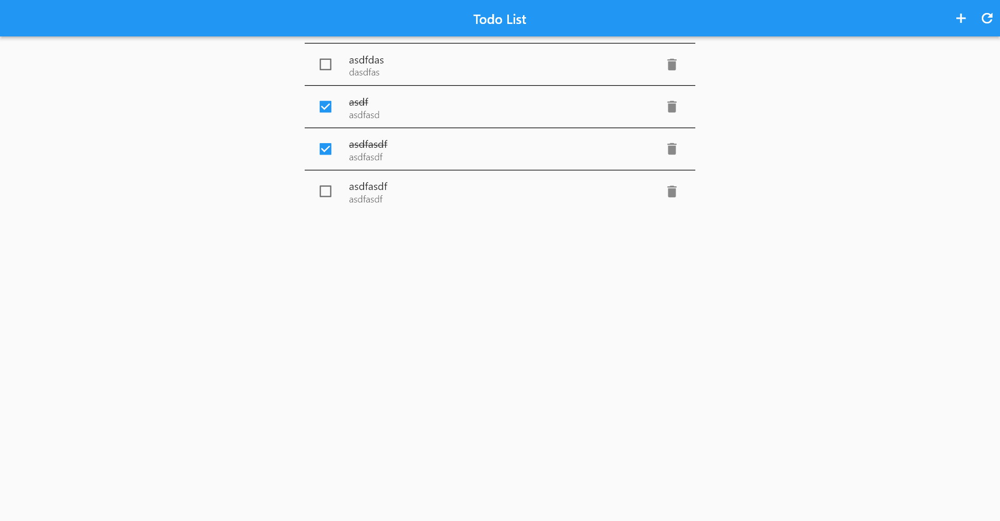

# todo_app

A new Flutter project.

## Description

This is a simple todo app that allows you to add, edit and delete tasks. It also allows you to mark tasks as complete or incomplete. The app uses a local database to store the tasks. The app also uses the provider package to manage state.
I have used REST API to fetch data from the server. The app uses the http package to make the API calls.

## Screenshots

## Getting Started

This project is a starting point for a Flutter application.

A few resources to get you started if this is your first Flutter project:

- [Lab: Write your first Flutter app](https://docs.flutter.dev/get-started/codelab)
- [Cookbook: Useful Flutter samples](https://docs.flutter.dev/cookbook)

For help getting started with Flutter development, view the
[online documentation](https://docs.flutter.dev/), which offers tutorials,
samples, guidance on mobile development, and a full API reference.
